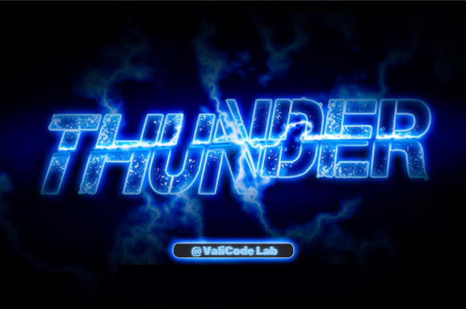

# ⚡ Valicode | Thunder Text Animation 🌩️  

Valicode brings **dynamic thunder animation** to your text! ⚡🔥 Watch your words come alive with electrifying lightning effects!  

## 📌 Features  
✅ **Real-time thunder effects** with animated text  
✅ Customizable text input for a **personalized experience**  
✅ **Interactive canvas** - click to generate **lightning sparks**  
✅ **Smooth animations** powered by JavaScript  

## 🛠️ Technologies Used  
- **HTML** 🎨  
- **CSS** 🖌️  
- **JavaScript (Canvas API)** ⚡ 

## 🔥 Preview


## 🎯 How to Use  
1️⃣ Open the **Thunder Text Animation** webpage 🌐  
2️⃣ Enter any text in the input box ✍️  
3️⃣ Watch the **thunder effects animate your text!** ⚡  
4️⃣ Click anywhere on the canvas to trigger **extra lightning sparks** 🌩️  

## 📂 Project Structure  
📂 Thunder-Text-Animation
┣ 📜 Valicode.html 👉 Main HTML file
┣ 📜 Valicode.css 👉 Stylesheet
┣ 📜 Valicode.js 👉 JavaScript logic

## 🚀 Get Started  
1. Clone this repository:  
   ```bash
   git clone https://github.com/Shivamgpt812/Thunder-Text-Animation.git

2. Open Valicode.html in your browser.

## 📜 License
This project is open-source and available under the MIT License.